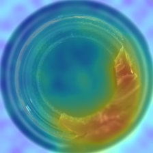
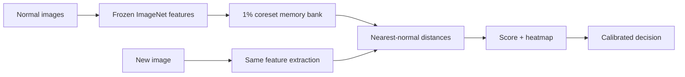
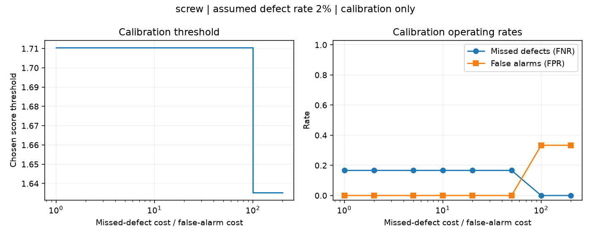

<div align="center">

# Industrial visual anomaly detection

Detect and localise manufacturing defects using a memory bank learned from **normal images only**.

[](https://github.com/Yass149/industrial-visual-anomaly/actions/workflows/ci.yml)


[Results](#measured-results) · [Run locally](#run-locally) · [Method](#how-it-works) · [Thresholds](#the-cost-of-a-wrong-decision) · [Project guide](#explore-the-project)

</div>

## Measured results

**0.952–1.000 image AUROC · 117–124 ms median CPU requests · three product categories**

| Category | Image AUROC | Pixel AUROC | Average precision | Missed defects | False alarms |
|:---|---:|---:|---:|---:|---:|
| Bottle | 1.000 | 0.984 | 1.000 | 7 / 44 | 0 / 14 |
| Screw | 0.952 | 0.979 | 0.984 | 15 / 83 | 1 / 29 |
| Carpet | 0.998 | 0.988 | 0.999 | 1 / 62 | 2 / 20 |

> **Ranking is only part of the story.** Bottle achieves perfect holdout AUROC, yet its calibrated threshold misses seven defects. Screw remains the hardest category for image-level detection.

<table>
<tr>
<td align="center" width="35%">

<br><sub>Real holdout image · anomaly overlay</sub>
</td>
<td>
<strong>One image, two outputs</strong><br><br>
An image score determines whether to flag the product at the calibrated threshold.<br><br>
A heatmap shows where patch features differ from the normal reference. Its colours are not defect probabilities.
</td>
</tr>
</table>

<details>
<summary><strong>Evaluation protocol and timing</strong></summary>

MVTec AD test images are split within each defect type: approximately **30% calibration / 70% evaluation**, seed 42. Only calibration data selects thresholds. Pixel metrics use resized centre crops; these are not official full-test benchmark results.

CPU timing: Apple M4, 20 warmed sequential TestClient requests per category. Medians: bottle **118 ms**, screw **117 ms**, carpet **124 ms**; maximum **301 ms**. Includes decoding and overlays; excludes startup and real network latency. This is not a load test.

[Saved evidence](docs/assets/measured_run.json). Full confusion matrices, PR curves, split manifests and error grids are generated in `results/`.

</details>

## Run locally

Requires **Python 3.11**. From a clone, reproduce the experiment:

```bash
make reproduce
```

This installs pinned dependencies, downloads missing data/weights, trains, evaluates, benchmarks and runs checks. Data defaults to `~/mvtec-data`; allow roughly 10 GB for archive plus extraction. Timing and floating-point results vary across machines.

Then launch the demo:

```bash
make serve
```

Open **http://127.0.0.1:8000**, upload a **PNG/JPEG**, and click **Inspect image**. The default category is **bottle**. Try:

```text
~/mvtec-data/mvtec/bottle/test/broken_large/000.png
```

Use the matching product and camera view. Change `serve.category` in [the config](configs/default.yaml) for screw or carpet. Arbitrary new products need their own normal reference data and model.

## How it works



This [PatchCore-style implementation](https://arxiv.org/abs/2106.08265) combines WideResNet50-2 layer2/layer3 features and greedy coreset selection. No anomalib model is used. A classifier needs defect labels; an autoencoder adds reconstruction training; PaDiM is a valid distribution-based alternative. Paper-level numerical parity and the coreset's accuracy cost remain unverified.

## The cost of a wrong decision

Threshold selection minimises:

```text
expected cost = r × p × missed-defect rate + (1 − p) × false-alarm rate
```

Defaults assume **r = 10×** missed-defect cost and **p = 2%** defect prevalence. These are assumptions, not measured business facts. Deployment PR estimates assume stable class-conditional distributions.



## Next steps & lessons

Next: independent calibration data, uncertainty estimates, full-frame inspection and controlled backbone/coreset comparisons. Cropping can hide border defects. Drift monitoring is a warning, not an accuracy guarantee. Docker remains untested; this is not production ready.

I would not again present method benefits without failure analysis, or compare heatmaps with independently rescaled colours.

## Explore the project

[Visual guide](docs/START_HERE.html) · [Code map](docs/CODE_MAP.md) · [Design decisions](docs/DECISIONS.md) · [Technical walkthrough](docs/DESIGN.md) · [Commands & return note](docs/RESUME.md)

Open the visual guide locally; GitHub displays its source. Local checks: **23 offline + 4 real-data tests passed**. CI runs lint and offline tests.

Dataset and adapted-image terms: [MVTec CC BY-NC-SA 4.0](https://www.mvtec.com/research-teaching/datasets/mvtec-ad) · [Figure attribution](docs/assets/ATTRIBUTION.md). Raw datasets and trained artifacts stay outside git.
