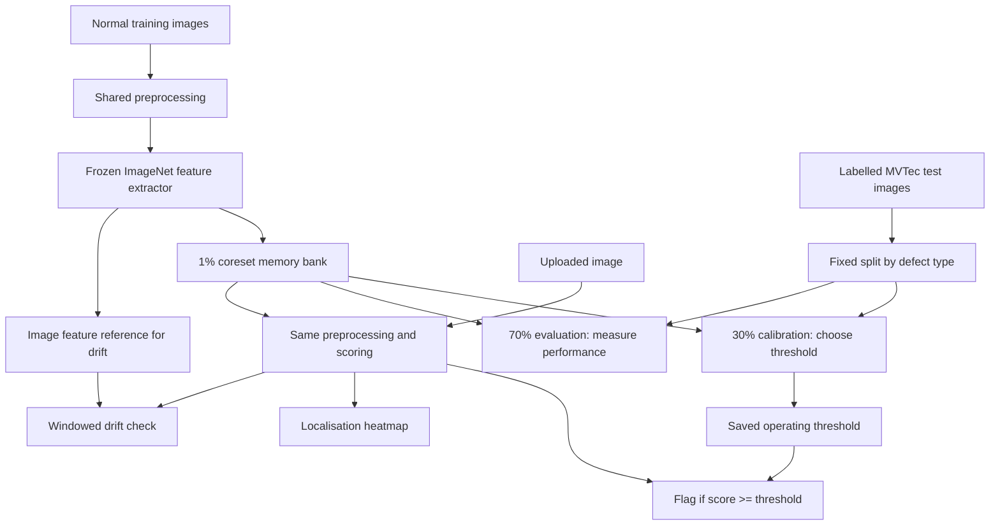

# How this project works

Start with [the visual guide](START_HERE.html). This document is the detailed reference;
you do not need to read it in one sitting. [CODE_MAP.md](CODE_MAP.md) lists every source file.

## 1. The problem and the boundary

Given a product image, return a distance-based anomaly score, a decision at a calibrated
threshold, and a heatmap of suspicious locations. The bank learns from **normal images only**.
It cannot name the defect type, estimate a probability of failure, or decide whether a product
is safe. It also does not recognise which product category was uploaded: the caller must use
the category configured for the service.

The inherited categories are bottle, screw, and carpet. Carpet is a texture, so this is two
object categories plus one texture, a deliberate retained deviation from the original brief's
“three object categories”. Changing it would invalidate the existing experiment. Adding a
fourth MVTec category requires adding its name to YAML, then training and evaluating it.

## 2. Three separate jobs

Calibration uses some labelled defects. That does **not** train the feature extractor or bank.
It does mean the operating threshold needs labelled examples; this is not an entirely
label-free end-to-end system. These are holdout metrics under our split, not full-test
benchmark numbers comparable to the paper.

## 3. Follow one bottle through training

| Stage | Shape / quantity | Why it exists |
|---|---|---|
| RGB image | original resolution | Three channels match the pretrained network |
| Resize / centre crop | 256 × 256 → 224 × 224 | Fixed, bounded computation with shared geometry |
| Tensor / normalise | B × 3 × 224 × 224 | Match ImageNet channel statistics |
| `layer2` | B × 512 × 28 × 28 | Local structure at useful spatial resolution |
| `layer3` | B × 1024 × 14 × 14 | Broader context |
| 3×3 average pool each | same shapes | Aggregate neighbouring activations |
| Upsample layer3 / concatenate | B × 1536 × 28 × 28 | Combine aligned local and contextual descriptors |
| Flatten | (B × 784) × 1536 | One row is one patch descriptor |
| Accumulate 209 normal bottles | 163,856 × 1536 | Candidate normal patches, about 1.01 GB of float32 values |
| Greedy coreset | 1,639 × 1536 | Keep about 1%, about 10.07 MB of bank values |

There is no optimiser, loss function, backward pass, or epoch count. “Fit” means extracting
normal descriptors and choosing representatives. The 10.07 MB bank is **not** the total
model memory: the backbone weights, activations, temporary distances, and monitoring reference
also occupy memory. Concatenating the training bank temporarily duplicates large arrays.

### Preprocessing (`data.py`)

`build_transform` is the single image pipeline used by training, evaluation, the CLI and API.
`build_display_transform` applies the same resize/crop to the displayed image. It intentionally
omits normalisation: a normalised tensor is for the network, not a photograph to show a user.
Masks use nearest-neighbour resize so binary labels do not acquire interpolated grey pixels.

Fixed centre cropping discards a 16-pixel border on each side of the resized 256-pixel image.
This is a real blind spot. It also means pixel AUROC refers to the **cropped/resized frame**,
not the original full-resolution inspection area. Other resize protocols are valid; this is
an implementation choice, not a claim that all published benchmarks use identical geometry.

No augmentation is used so the baseline is simple and reproducible. This is not a theorem
that augmentation harms anomaly detection: realistic rotations or illumination changes may
improve coverage. They require testing and should reflect the camera's actual variability.

`MVTecDataset` sorts paths, detects missing masks, and rejects anomalous training images.
`Sample` carries image, mask, label, path and defect type. `collate_samples` stacks tensors while
keeping provenance as lists. Labels are 0 for good, 1 for defective.

### Frozen features (`features.py`)

WideResNet50-2 uses torchvision's explicit `IMAGENET1K_V1` weights. `eval()` fixes BatchNorm's
running statistics; disabling gradients alone would not do that. Forward hooks capture the
configured layers. The whole backbone still runs, including layers after the last captured
layer; stopping early is a possible future speed improvement, not implemented here.

Mid-level layers are a practical compromise. Early layers can be useful for small texture
defects; deeper layers can provide useful semantics but have coarser maps. The chosen pair
has not been established as optimal for these three categories through an ablation.
`flatten_patches` permutes B,D,H,W to B,H,W,D before reshaping, preserving spatial order.

### Coreset (`coreset.py`)

A seeded Gaussian projection reduces descriptors to 128 dimensions **for selection only**.
The stored bank retains the original 1536-dimensional descriptors. This is an approximation;
128 dimensions is a speed heuristic, not a proved distortion bound for this dataset.

Start with the point furthest from the projected centroid. Maintain each point's distance to
its nearest selected point. Repeatedly select the worst-covered point, then update those
minimum distances. This greedy approximation encourages coverage of rare normal patterns.
It does not prove global optimality or guarantee better downstream accuracy than random
sampling. Selected indices are masked out, including when multiple rows are identical.
The number retained is `ceil(N * coreset_ratio)`.

The 1% ratio is inherited. Its accuracy cost versus a full bank remains **unmeasured**.
A smaller bank usually reduces search cost but may omit useful normal variation. A full bank
avoids subsampling loss but substantially increases memory and distance computation.

## 4. Follow a new image through scoring (`patchcore.py`)

1. Extract the same 784 descriptors, each 1536-dimensional.
2. Compute Euclidean distances to the category's bank using `torch.cdist`.
3. For each descriptor, keep its smallest distance and the matching bank index.
4. Use the largest patch distance to find the image's most unusual location.
5. Reweight that image score using the matched bank entry's nearest neighbours.
6. Reshape patch distances to 28×28, upsample to 224×224, and Gaussian-smooth for the pixel map.

Feature extraction can run on a configured accelerator; bank matching currently runs on CPU.
Distance calls are chunked over query rows, bounding that dimension but **not** arbitrary bank
size. Computing the cached bank-neighbour graph is still O(K²) memory and time. These choices
are acceptable for the small default banks; do not assume they scale to a full bank.

Max pooling is sensitive to small isolated defects but also to a single noisy patch. A mean
can dilute a small defect. A top-k mean could be a useful compromise, but was not tested.

Let p* be the worst test patch and m* its nearest bank entry. Among the b bank neighbours of
m*, compute distances d_j from p*. The multiplier is `1 - softmax(d)[0]`, where column zero is
m* itself. This implements the exponential ratio without overflow. Self is explicitly placed
first to avoid float32 distance errors and duplicate-feature ties. In sparse neighbourhoods
other neighbours can be far away, making the multiplier closer to one. In evenly supported
neighbourhoods the multiplier is closer to `1 - 1/b`. The pixel map uses unweighted patch
distances; it is not the image score repeated over pixels. With one neighbour, use the raw max.

`ScoreResult` includes the scores, maps and spatially averaged feature vectors for monitoring.
These outputs are distances/features, not calibrated probabilities.

### Persistence and provenance

Each `.pt` stores the bank, feature geometry, training settings and monitoring reference.
Loading uses `weights_only=True` and refuses incompatible feature/preprocessing settings.
The threshold JSON stores a SHA-256 of the exact artifact and a signature of all scoring
settings plus the implementation version. Changing the bank, coreset setting, score settings,
cost ratio or base rate requires reevaluation before the service will start.

The pretrained backbone weights remain in the torch cache and are not embedded in each bank.
First-time training can download them. The default Docker build preloads those weights.
A custom backbone needs its corresponding weights available at runtime.

## 5. Honest evaluation (`evaluation.py`, `scripts/evaluate.py`)

The user-approved protocol uses a fixed seed and stratifies each defect type, including good,
into about 30% calibration and 70% evaluation. Counts are rounded per group, so the overall
fraction is approximate. At least one example remains on each side. This is an image-level
split; if related images share a manufacturing batch, independence could still be overstated.
No batch metadata is available here to enforce group separation.

Only calibration labels/scores enter threshold selection and cost sweeps. Heatmap colour
bounds also come from calibration. Evaluation then uses the frozen threshold. The split and
every image's score are saved in `results/<category>/predictions.json` with relative paths.
The pixel arrays for evaluation are stored separately to make pixel AUROC inspectable.

| Output | Meaning | Limitation |
|---|---|---|
| Image AUROC | Ranking of defective vs normal images over thresholds | Does not select a useful operating point |
| Pixel AUROC | Ranking defective vs normal pixels pooled over holdout crops | Background pixels dominate; localisation quality is not fully captured |
| Average precision (AP) | Recall-weighted precision, a common PR summary | Depends strongly on defect prevalence |
| Trapezoidal PR-AUC | Geometric area with linear interpolation | Different convention from AP; reported separately |
| Confusion matrix | Actual counts at the fixed threshold | Depends on the chosen costs and calibration sample |
| Scenario AP/precision | Reweight classes to the configured defect rate | Assumes unchanged class-conditional score distributions |

Confusion matrices are `[[TN, FP], [FN, TP]]`: rows actual, columns predicted. Zero predicted
positives makes precision undefined (`null`), not perfect. The deployment scenario does not
turn this dataset into real factory data or validate a 2% prevalence assumption.

The worst false-positive grid sorts errors by descending score; the false-negative grid
sorts missed defects by ascending score. White contours mark ground-truth defect boundaries.
All images within a category share calibration colour bounds. A no-error panel explicitly
says so instead of substituting unrelated examples. Overlay colours are not a binary mask.

## 6. The business decision (`threshold.py`)

Set a false alarm's cost to 1. Let r be the relative cost of missing a defect, and p the expected
defect rate. For any threshold:

`expected cost per image = r * p * FNR + (1 - p) * FPR`

This combines **conditional error rates**, not raw benchmark counts, because the benchmark's
class balance differs from a factory's. Default r=10 and p=0.02 are assumptions, not measured
business facts. Include all distinct score cutoffs, alarm-all and alarm-none. Among equal
costs, choose the higher threshold to reduce alarms. The finite `nextafter(max_score, +inf)`
represents alarm-none on calibration data and remains JSON-safe.

Example: 10,000 products at 2% defects contain 200 defective and 9,800 normal units in
expectation. FNR=10% misses 20; FPR=1% creates 98 false alarms. At r=10 the expected cost is
298 false-alarm cost units. This is an illustrative calculation, not a measured result.

Increasing r often favours lower thresholds, but it need not change the selected threshold
at every setting. On a perfectly separated calibration sample the same zero-cost threshold
can win the entire sweep. Bottle demonstrates that zero **calibration** cost still permits
misses on unseen images. Small normal calibration sets give particularly noisy estimates of
rare false alarms. Bootstrap uncertainty or repeated/grouped splits are future work; do not
keep retuning against this same holdout after inspecting its failures.

## 7. Serving (`api.py`, `frontend.html`)

`make serve` starts one configured category at `http://127.0.0.1:8000`.
Startup loads and checks the artifact/threshold, creates the drift reference and warms the
model before `/health` reports ready. `POST /predict` accepts a multipart field named `file`.
Malformed, missing, oversized or undecodable uploads return 422. The decoded pixel limit
bounds image expansion; a public deployment also needs ingress/body/concurrency limits.

The response contains category, raw anomaly score, threshold, `is_anomaly`, a base64 PNG
overlay, processing latency and monitoring status. Preprocessing and display geometry are
shared with evaluation. Latency covers upload reading through overlay encoding after the
endpoint starts; it excludes network transfer before the endpoint, startup and response
serialization. The separate API benchmark includes local TestClient request/response work
and still excludes real network latency. It uses sequential warmed requests, not a load test.

Inference runs in a thread pool so the event loop is not blocked. A lock protects the backbone's
mutable forward-hook dictionary and the monitor. It serializes model inference, so concurrency
can add queueing delay. Multiple workers duplicate memory and have independent drift windows.
The plain frontend reports the configured category, decision, score, threshold, latency,
overlay and crop limitation. It cannot verify whether the uploaded product matches the bank.

The Dockerfile defines a non-root single-worker CPU service and healthcheck. Mount the artifact
directory after training/evaluation. Docker is not installed in the development environment,
so the image build/run is **not verified**. CI is configured but a remote run is not claimed.

## 8. Monitoring (`monitoring.py`)

At training time take each image's mean descriptor across spatial positions, then keep a
seeded sample of up to 256 image vectors. Do not use the coreset as a reference: it intentionally
oversamples rare patterns and is not representative of frequency.

At inference take the same mean vector. Project onto eight fixed, seeded directions. After
64 incoming images, run a two-sample Kolmogorov–Smirnov test per projection against training.
Bonferroni-adjust the smallest p-value across those eight tests; warn below alpha=0.01.
Clear the window, so incoming windows do not overlap. A logged warning asks for investigation;
it never changes the bank, threshold or decisions.

This can miss shifts invisible to the eight projections or diluted by spatial averaging.
Incoming images may be correlated; repeated testing over time still creates false alarms.
Defects themselves can trigger a shift, not only camera drift. The state lives in process
memory and resets on restart. The monitor does not prove accuracy has fallen, or that it has
stayed constant when no warning fires.

## 9. Reproducibility and tests

Python 3.11, exact direct/transitive dependency pins, fixed seeds, deterministic transforms,
sorted inputs, fixed split manifests and artifact fingerprints make the experiment traceable.
`make reproduce` installs/checks data, trains, evaluates, benchmarks, lints and runs tests.
It does not promise bitwise equality across hardware, BLAS/CUDA versions or batch sizes.
Latency is especially machine- and load-dependent. Environment metadata is in `metrics.json`.

Offline tests use a tiny deterministic extractor while exercising the real coreset, bank,
scoring, persistence, threshold and API code. They do not establish real-world accuracy.
Integration tests use real local MVTec fixtures and the pretrained backbone; full evaluation
measures all held-out images. Fast tests need neither data nor a weight download. Integration
tests skip if artifacts/data are absent. `make integration` after `make evaluate` should not skip.

CI runs lint, black and offline pytest. Network-dependent data/weights stay out of CI.
External Starlette/httpx deprecation warnings remain with the pinned environment; tests pass.

## 10. Evidence and next decisions

Use `results/metrics.json` for numerical evidence, `results/api_benchmark.json` for request
latency, and the image-level manifests to investigate failures. The compact saved reference
run in `docs/assets/measured_run.json` makes the README auditable without downloading data.

Next: independent calibration data with more normal images, uncertainty estimates, border
coverage, controlled coreset/backbone ablations, then deployment load testing. Do not enlarge
the model just because the benchmark has difficult screws. First inspect whether the failures
come from the threshold, cropped defects, small feature resolution or unseen normal variation.

References: [PatchCore paper](https://arxiv.org/abs/2106.08265),
[AP definition](https://scikit-learn.org/stable/modules/generated/sklearn.metrics.average_precision_score.html),
[KS two-sample test](https://docs.scipy.org/doc/scipy/reference/generated/scipy.stats.ks_2samp.html),
[MVTec dataset and licence](https://www.mvtec.com/research-teaching/datasets/mvtec-ad).
The implementation is PatchCore-style, not a numerically validated reproduction of every
feature-aggregation detail in the authors' implementation. No anomalib model is used.
